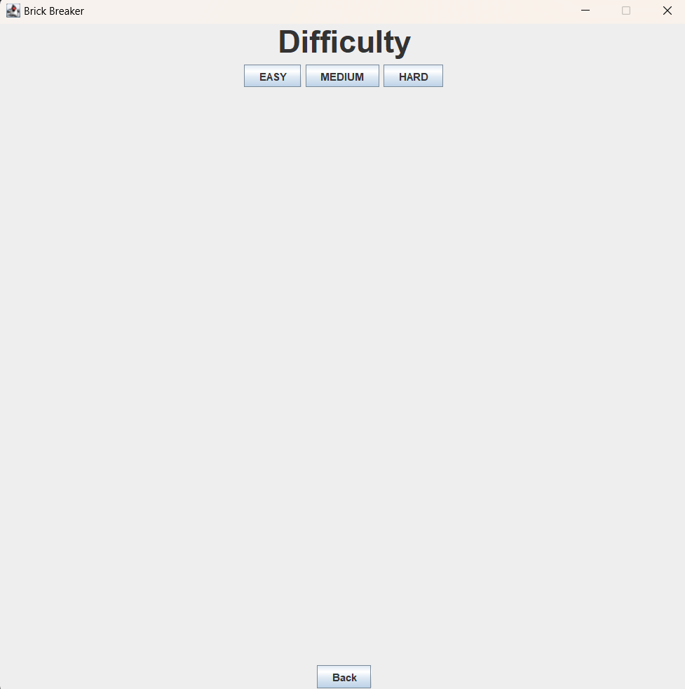
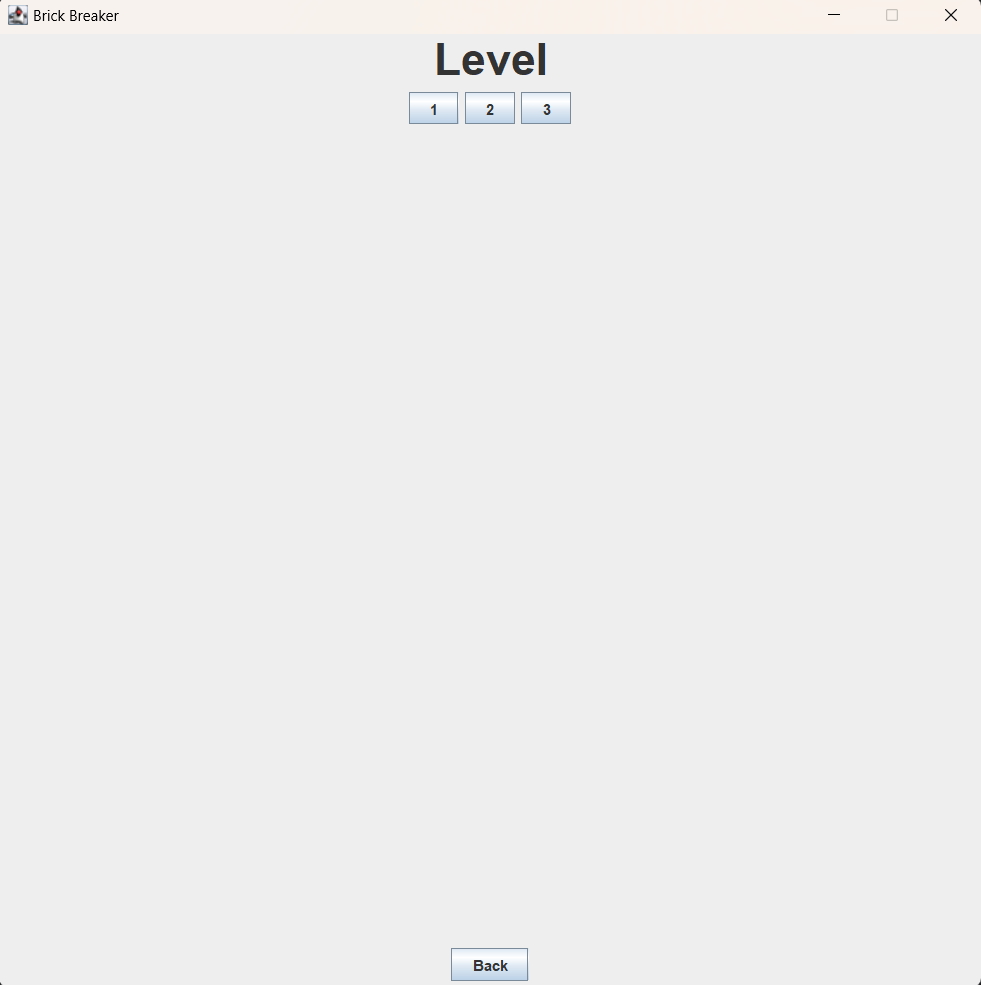
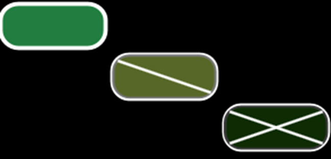

# 🧱 Brick breaker game

Classic game clone in which the player must smash the brick layout by deflecting the bouncing ball with the paddle.

---

## Installation

1. Download latest JAR [package](release/BrickBreaker_1.0.1.jar)
2. Create new folder `BrickBreaker`
3. Move downloaded package to `BrickBreaker`

### Requirements:

- Java 23 (OpenJdk 17)

Checking version (`bash`,`cmd`)

```bash
java -version
```

### Linux / MacOS

```bash
java -jar BrickBreaker_1.0.1.jar
```

### Windows

#### 1. Double click `BrickBreaker_1.0.1.jar`

#### 2. Open Command Prompt (If double click doesn't work)

```shell
java -jar BrickBreaker_1.0.1.jar
```
---

## Game features

- 3 difficulty modes



- 3 levels per difficulty



- 3 destruction levels for single brick



- Chill music
- Saving progress